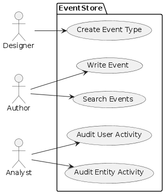

# System Behavior (Use Cases)

## Use Case Diagram

Primary Actors:

* Designers
* Authors
* Auditors

Use Cases:

* Create Event Type
* Write Event
* Search Events
* Audit User Activity
* Audit Entity Activity

## Use Case Narrative: Write Event

### Use Case Name
Write Event

### Primary Actor
Author

### Goal
Record an event in the event stream.  Optionally, the event may be linked to other events.  For example, an event recording a correction to an address is linked to the address-create event.

### Preconditions
- The event to be recorded must consist of valid JSON.

### Main Succes Scenario
1. The author submits an event
2. The system generates a universally-unique event ID and associates this event ID to the event
3. The system provides success confirmation and the event ID to the author.

### Extensions (Alternative Flows)
- 1a. Invalid JSON:
    - The system notifies the author and provides an error message with some indication of what is invalid about the JSON
    - The event is not recorded in the event stream
- 1b. Non-existent referenced event:
    - The system notifies the author that one or more referenced events do not exist (listing each such non-existent referenced event)
    - The event is not recorded in the event stream

### Postconditions
1. The event is recorded and is returned by searches that match the event (e.g., by event ID)
