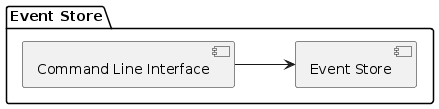

# System Behavior (Architecture)

## Architecture Style

- Monolith (CLI App)

As a proof of concept, I need only a very simple interface.  The event store will be a simple Linux service, with a command line to submit and query events.

## Component Diagram

## Tech Stack

Programming Language: Java

Communication Mechanism: TCP Sockets 

## Repository Strategy

Mono-repo Repository Structure.  The event store and the client will be in the same repository.
